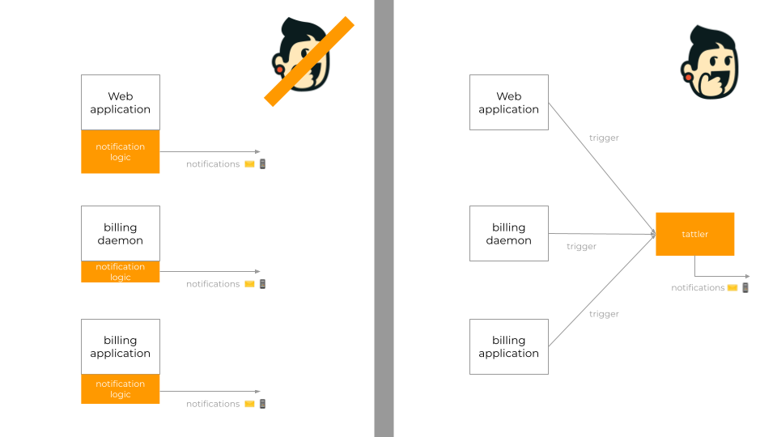
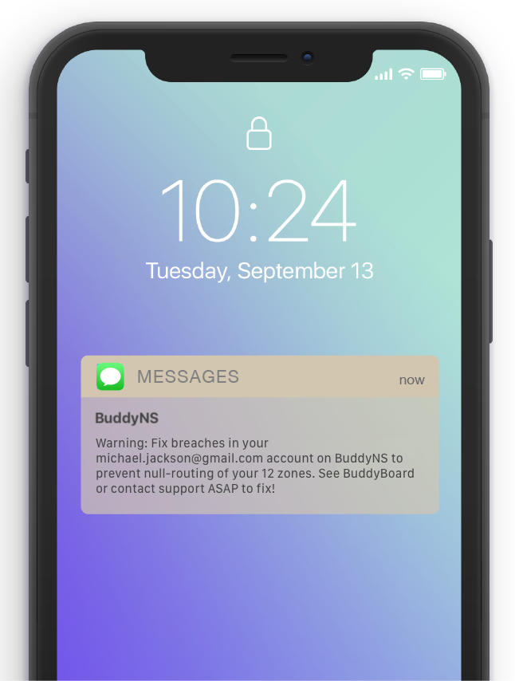

Tattler -- a notification system for humans
===========================================

Are you building an online service and need to send beautiful, branded notifications via email or SMS to your users?

Tattler makes that easy for you. Your application makes a simple HTTP call to tattler:

.. code-block:: bash

   curl -X POST 'http://127.0.0.1:11503/notification/mywebapp/password_changed/?user=123'

and tattler does this for you:

1. Load your templates for event ``password_changed``, and see where it should be notified. (Email? SMS? More?)
2. Load the email address and mobile number for user ``123`` as required -- with trivial-to-write plug-ins.
3. Load any variable that your templates require -- with trivial-to-write plug-ins. (What plan is the user on? How much of the plan is used up?)
4. Expand the template and encode the content into an actual notification -- e.g. a multi-part MIME email with HTML and plain text fallback.
5. Deliver the final content through SMTP and an SMS delivery network.

Tattler is designed with simplicity in mind. It strives to be easy to adopt and useful among common needs -- so you
can focus on your communication, brand and customer journey.

If your system sends notifications from multiple different softwares -- say a web application, a billing daemon,
and a cron job which monitors inventory -- then your simplification gains with tattlers get multipled 🚀

Examples
========

Here's an example notification with HTML email, and its corresponding plain text version:

.. list-table:: 

    * - .. figure:: ../../demos/tattler-notification-example-email-html.png

           Fig 1. Example notification as HTML email.

      - .. figure:: ../../demos/tattler-notification-example-email-plaintext.png

           Fig 2. Its corresponding plain text version.

And here's an example SMS notification:

Why tattler?
------------

Introducing Tattler simplifies code and consolidates your communication to your users, making it easier to manage and improve.

**Product managers**
   Will love having a clear view of the communication across the customer journey, and the ease of improving it.

**Template designers**
   Will love the design power and ability to focus on content without technical distractions. 

**Developers**
   Will love the massive simplification in their code — firing notifications without having to collect all ancillary data.

**Customer support**
   Will love being able to easily trace notifications to log trails in other systems that led to firing them. 

**Sys admins**
   Will love having one single point of exit for notifications and the ease of compartmentalizing access to sensitive data. 

Tattler is `well-documented <https://docs.tattler.dev>`_, has `safeguarded longevity <https://tattler.dev#enterprise>`_
and has outstanding quality thanks to its exceptional 90%+ test coverage.

License
=======

Tattler is open-source software (BSD 3-clause license), and includes the features listed above.

Enterprise users
================

Tattler is `enterprise-friendly <https://tattler.dev/#enterprise>`_. Enterprise users avail of a
subscription which provides a bugfixing warranty, extra features, and patronage for the continuity
of the project.

See :doc:`enterprise` for more.

Contents
========

Proceed to the following contents to learn about deploying and using Tattler for your project.

.. toctree::
   :hidden:
   
   quickstart
   roles
   keyconcepts/index
   productmanagers
   templatedesigners/index
   testing/index
   developers/index
   plugins/index
   sysadmins/index
   configuration
   enterprise
   diagrams

Indices and tables
==================

* :ref:`genindex`
* :ref:`modindex`
* :ref:`search`
